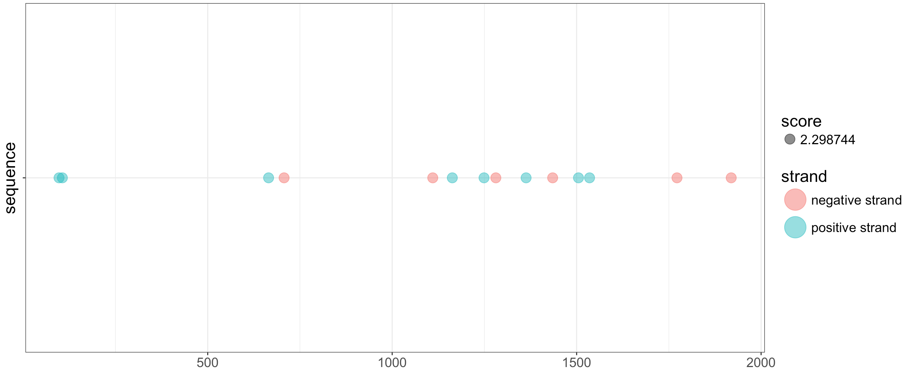

# AB Map Motif

I modified [map_motif](https://github.com/iamciera/map_motif) for Augusto.

## About

This script maps motifs across multiple sequence using the Biopython's motif package. The differnce from the original is that some of the features have been removed.

## 1.TFBSmapping_for_augusto.ipynb

In py folder, a jupyter notebook that performs the mapping of a motif to a seqence or multiple sequences.

**Inputs**: 
1. alignment (fasta) 
3. TFBS Position Frequency Matrix.

**Outputs**:
-`.csv` file that outputs found TFBSs at *each position*, if any, in alignment. 

Output data frame includes:
-  position
-  score
-  sequence entry
-  raw_position (from each sequence entry)
-  strand (which direction the motif was found)
-  motif

## 2.visualization_TFBS_cleaning.Rmd

In R folder, a Rstudio markdown document which does a basic visuaization. 

